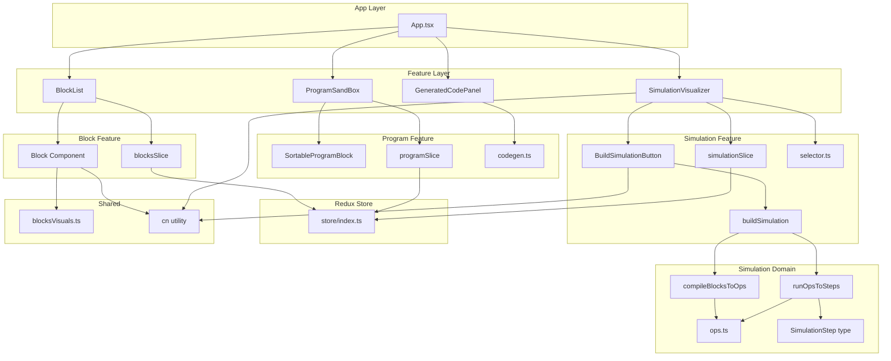

# Stage 2 - JS-View Development Summary

> **Document Date**: December 11, 2025  
> **Project**: JS-View - JavaScript Event Loop Visualizer  
> **Status**: Event Loop Simulation Feature Complete

---

## 📋 What's New Since Stage 1

Stage 2 introduces the **Event Loop Simulation Engine** — the core educational feature that brings the Event Loop to life. Users can now:

1. **Build simulations** from their block programs
2. **Step through** the execution one frame at a time
3. **Visualize** the Call Stack, Microtask Queue, Macrotask Queue, and Web APIs
4. **See console output** in real-time as the simulation runs
5. **Control playback** with play/pause, speed adjustment, and autoplay looping

---

## 🛠️ Technology Stack (Updated)

### Dependencies Added/Updated
| Technology | Version | Purpose |
|------------|---------|---------|
| **@dnd-kit/modifiers** | 9.0.0 | Drag modifiers |
| **@dnd-kit/utilities** | 3.2.2 | DnD utilities |

> The core stack remains the same (React 19, Redux Toolkit, TailwindCSS 4, Vite 6).

---

## 📁 Project Architecture (Updated)

```
src/
├── App.tsx                 # Root component - Now includes SimulationVisualizer
├── main.tsx                # React entry point with Redux Provider
├── vite-env.d.ts           # Vite environment types
│
├── store/                  # Redux Store Configuration
│   ├── index.ts            # Store with blocks, program, AND simulation reducers
│   └── hooks.ts            # Typed useAppDispatch & useAppSelector
│
├── domain/                 # Domain Layer (Types & Business Logic)
│   ├── blocks/
│   │   └── types.ts        # BlockType, BlockCategory, BlockDefinition
│   ├── program/
│   │   ├── types.ts        # ProgramBlockInstance
│   │   └── codegen.ts      # Code generation from blocks
│   └── simulation/         # [NEW] Simulation domain logic
│       ├── types.ts        # SimulationStep type
│       ├── ops.ts          # SimulationOp discriminated union
│       ├── compileBlocksToOps.ts  # Blocks → Ops compiler
│       ├── runOpsToSteps.ts       # Ops → Steps simulator
│       └── buildSimulation.ts     # Orchestration function
│
├── features/               # Feature-based modules
│   ├── blocks/             # Block palette feature (unchanged)
│   │   ├── BlockList.tsx
│   │   ├── blocksSlice.ts
│   │   └── blocksVisuals.ts
│   ├── program/            # Execution thread feature (unchanged)
│   │   ├── ProgramSandBox.tsx
│   │   ├── SortableProgramBlock.tsx
│   │   └── programSlice.ts
│   ├── code-panel/         # Code output feature (unchanged)
│   │   └── GeneratedCodePanel.tsx
│   └── simulation/         # [NEW] Simulation visualization feature
│       ├── SimulationVisualizer.tsx   # Main UI component
│       ├── BuildSimulationButton.tsx  # Build trigger button
│       ├── simulationSlice.ts         # Redux slice for simulation state
│       └── selector.ts                # Memoized selectors
│
├── components/             # Reusable UI components
│   ├── block/
│   │   └── Block.tsx
│   └── tooltip/
│       └── BlockTooltip.tsx
│
├── styles/
│   └── global.css          # [UPDATED] New warm color palette & animations
│
└── utils/
    └── cn.ts               # ClassName utility (clsx + twMerge)
```

---

## 🧩 New Domain Types

### Simulation Types

```typescript
// src/domain/simulation/types.ts

export type SimulationStep = {
    id: string                // Unique ID (nanoid)
    callStack: string[]       // Current call stack frames
    microTaskQueue: string[]  // Pending microtasks
    macroTaskQueue: string[]  // Pending macrotasks
    webApis: string[]         // Active Web API items (timers, etc.)
    consoleOutput: string[]   // Accumulated console output
    description: string       // Human-readable step description
}
```

### Simulation Operations

```typescript
// src/domain/simulation/ops.ts

import type { BlockType } from '../blocks/types'

export type SimulationOp =
    | { kind: 'syncLog'; message: string; source: BlockType }
    | { kind: 'scheduleMicrotask'; message: string; source: BlockType }
    | { kind: 'scheduleMacrotask'; message: string; source: BlockType }
```

---

## 🔄 State Management (Updated)

### Store Structure

```typescript
{
  blocks: {
    available: BlockDefinition[]    // Predefined block definitions
  },
  program: {
    blocks: ProgramBlockInstance[]  // User's executed blocks
    nextSequence: number            // Counter for label generation
  },
  simulation: {                     // [NEW]
    steps: SimulationStep[]         // All simulation steps
    currentStepIndex: number        // Current step being viewed
    status: SimulationStatus        // 'idle' | 'ready' | 'running' | 'paused' | 'finished'
    playback: {
      autoplay: boolean             // Loop simulation when finished
      speedMs: number               // Delay between steps (250-1250ms)
    }
    builtHash: string | null        // Hash of blocks when simulation was built
  }
}
```

### New Actions (simulation slice)

| Action | Description |
|--------|-------------|
| `setSteps({ steps, blockHash })` | Loads simulation steps and marks build hash |
| `resetSimulation()` | Returns to initial state |
| `goToStep(index)` | Jumps to specific step |
| `nextStep()` | Advances to next step |
| `prevStep()` | Goes back to previous step |
| `goToEnd()` | Jumps to final step |
| `play()` | Starts automatic playback |
| `pause()` | Pauses playback |
| `setSpeedMs(ms)` | Sets playback speed |
| `setPlayback({ autoplay?, speedMs? })` | Updates playback settings |
| `setStatus(status)` | Sets simulation status |

### New Selectors

| Selector | Description |
|----------|-------------|
| `selectSimulationState` | Returns entire simulation slice |
| `selectCurrentSimulationStep` | Returns current step object or null |
| `selectIsSimulationStale` | Returns true if program changed since last build |
| `selectCurrentBlockHash` | Returns hash of current program blocks |

---

## ⚙️ Key Functions (New)

### Simulation Pipeline

The simulation system uses a **two-phase compilation** approach:

```mermaid
graph LR
    A[ProgramBlockInstance[]] -->|compileBlocksToOps| B[SimulationOp[]]
    B -->|runOpsToSteps| C[SimulationStep[]]
    
    D[buildSimulation] -.orchestrates.-> A
    D -.orchestrates.-> B
    D -.orchestrates.-> C
```

#### `compileBlocksToOps(instances: ProgramBlockInstance[]): SimulationOp[]`
Converts user program blocks into atomic simulation operations:

| Block Type | Generated Ops |
|------------|---------------|
| `console` | 1× `syncLog` |
| `forLoop` | 2× `syncLog` (iterations) |
| `asyncAwait` | 1× `syncLog` (PRE), 1× `scheduleMicrotask` (POST) |
| `promiseThen` | 1× `scheduleMicrotask` |
| `timeout` | 1× `scheduleMacrotask` |

#### `runOpsToSteps(ops: SimulationOp[]): SimulationStep[]`
Executes operations against a virtual runtime, capturing state snapshots:

```typescript
type RuntimeState = {
    callStack: string[]
    microTasks: { message: string; source: BlockType }[]
    macroTasks: { message: string; source: BlockType }[]
    webApis: string[]
    consoleOutput: string[]
}
```

**Execution Order:**
1. Process all synchronous ops first (push to call stack, log, pop)
2. Drain microtask queue (one at a time, checking for new microtasks)
3. Process one macrotask (then check microtask queue again)
4. Repeat until all queues are empty
5. Final step shows completion message

#### `buildSimulation(instances: ProgramBlockInstance[]): SimulationStep[]`
Orchestration function that chains `compileBlocksToOps` → `runOpsToSteps`.

---

## 🖥️ Main Components (Updated)

### `App.tsx` (Updated Layout)

The root component now displays:
1. `BlockList` — Available blocks palette
2. `ProgramSandBox` + `GeneratedCodePanel` — Stacked vertically
3. `SimulationVisualizer` — Event loop visualization (takes flex-1 width)

### `SimulationVisualizer.tsx` [NEW]

The main simulation UI component featuring:

**Header Controls:**
- **Build/Rebuild button** — Compiles current program to simulation
- **Play/Pause buttons** — Control automatic playback
- **Step forward/back** — Manual navigation
- **Reset/End buttons** — Jump to start/end
- **Speed slider** — 250ms (fast) to 1250ms (slow)
- **Autoplay toggle** — Loops simulation continuously

**Visualization Panels (2×2 grid):**
- **Call Stack** — Shows current executing frame
- **Web APIs** — Shows active timers/tasks
- **Microtask Queue** — Shows pending Promise callbacks
- **Macrotask Queue** — Shows pending setTimeout callbacks

**Console Output:**
- Fixed height panel showing accumulated logs

**Playback Logic:**
```typescript
useEffect(() => {
    if (simulation.status !== 'running') return
    
    const id = setTimeout(() => {
        if (!isLastStep) {
            dispatch(nextStep())
        } else if (simulation.playback.autoplay) {
            dispatch(goToStep(0))  // Loop back to start
            dispatch(play())
        }
    }, simulation.playback.speedMs)
    
    return () => clearTimeout(id)
}, [/* dependencies */])
```

### `BuildSimulationButton.tsx` [NEW]

Animated button that:
- Glows when simulation is **stale** (program changed)
- Shows "Build" when stale, "Rebuild" when current
- Uses shimmer animation when stale
- Triggers `buildSimulation()` and dispatches `setSteps()`

---

## 🎨 Visual Design System (Updated)

### Color Palette (New Warm Theme)

The design system was updated from a cool AI-like dark theme to a **warm, earthy palette**:

```css
/* Background Colors - Warm brown/sepia tones */
--color-bg-app: hsl(40, 20%, 5%)           /* Deep brown-black */
--color-bg-panel: hsl(40, 18%, 8%)         /* Dark brown */
--color-bg-block: hsl(40, 16%, 12%)        /* Medium dark brown */
--color-bg-block-hover: hsl(40, 18%, 16%)  /* Lighter brown hover */
--color-bg-console: hsl(40, 20%, 6%)       /* Console background */
--color-bg-block-strong: hsl(40, 20%, 14%) /* Emphasized block */
--color-border-subtle: hsl(40, 25%, 18%)   /* Subtle borders */

/* Text Colors - Warm creams */
--color-text-primary: hsl(42, 50%, 92%)    /* Warm white */
--color-text-muted: hsl(40, 20%, 55%)      /* Muted tan */

/* Accent Colors - Per block type */
--color-accent-console: hsl(174, 60%, 55%)     /* Teal */
--color-accent-forLoop: hsl(200, 65%, 58%)     /* Sky blue */
--color-accent-timeout: hsl(25, 85%, 62%)      /* Burnt orange */
--color-accent-promiseThen: hsl(262, 80%, 72%) /* Soft purple */
--color-accent-asyncAwait: hsl(330, 75%, 65%)  /* Rose pink */

/* Gold Accent (CTA buttons) */
--color-accent-gold: hsl(47, 72%, 53%)
--color-accent-gold-hover: hsl(47, 80%, 60%)
--color-accent-gold-muted: hsl(47, 50%, 40%)

/* Status Colors */
--color-accent-success: hsl(142, 70%, 55%)  /* Green */
--color-accent-warning: hsl(47, 85%, 55%)   /* Yellow */
--color-accent-danger: hsl(0, 75%, 62%)     /* Red */

/* Zone Colors (Simulation panels) */
--color-zone-callstack: hsl(217, 80%, 65%)  /* Blue */
--color-zone-microtask: hsl(280, 70%, 68%)  /* Purple */
--color-zone-macrotask: hsl(32, 90%, 58%)   /* Orange */
--color-zone-webapi: hsl(174, 60%, 50%)     /* Cyan */
```

### New Shadows & Effects

```css
/* Card shadows */
--shadow-card-soft: 0 4px 16px hsla(40, 30%, 4%, 0.5)

/* Glow effects per block type */
--shadow-glow-console: 0 0 12px hsla(174, 60%, 55%, 0.3)
--shadow-glow-forLoop: 0 0 12px hsla(200, 65%, 58%, 0.3)
--shadow-glow-timeout: 0 0 12px hsla(25, 85%, 62%, 0.3)
--shadow-glow-promiseThen: 0 0 12px hsla(262, 80%, 72%, 0.3)
--shadow-glow-asyncAwait: 0 0 12px hsla(330, 75%, 65%, 0.3)

/* Status glows */
--shadow-glow-success: 0 0 14px hsla(142, 70%, 55%, 0.35)
--shadow-glow-warning: 0 0 14px hsla(47, 85%, 55%, 0.35)
--shadow-glow-danger: 0 0 14px hsla(0, 75%, 62%, 0.35)
```

### New Animations

```css
/* Subtle pulsing for CTA buttons */
@keyframes pulse-subtle { 
    0%, 100% { opacity: 1; box-shadow: 0 4px 12px hsla(48, 72%, 43%, 0.25); }
    50% { opacity: 0.92; box-shadow: 0 4px 20px hsla(47, 72%, 53%, 0.4); }
}

/* Shimmer effect for stale indicators */
@keyframes shimmer {
    0% { transform: translateX(-100%); }
    100% { transform: translateX(100%); }
}

/* Gold shimmer for highlights */
@keyframes gold-shimmer {
    0% { background-position: -200% center; }
    100% { background-position: 200% center; }
}

/* Breathing glow effect */
@keyframes breathe {
    0%, 100% { box-shadow: 0 0 8px hsla(47, 72%, 53%, 0.15); }
    50% { box-shadow: 0 0 16px hsla(47, 72%, 53%, 0.3); }
}
```

---

## 🗂️ File Summary (Updated)

| Path | Lines | Purpose |
|------|-------|---------|
| `src/App.tsx` | 19 | Root layout with SimulationVisualizer |
| `src/main.tsx` | 24 | React/Redux entry |
| `src/store/index.ts` | 17 | Redux store with 3 reducers |
| `src/store/hooks.ts` | 7 | Typed Redux hooks |
| **Domain - blocks** |||
| `src/domain/blocks/types.ts` | 13 | Block type definitions |
| **Domain - program** |||
| `src/domain/program/types.ts` | 8 | Program instance types |
| `src/domain/program/codegen.ts` | ~72 | Code generation logic |
| **Domain - simulation [NEW]** |||
| `src/domain/simulation/types.ts` | 10 | SimulationStep type |
| `src/domain/simulation/ops.ts` | 19 | SimulationOp union type |
| `src/domain/simulation/compileBlocksToOps.ts` | 75 | Blocks → Ops compiler |
| `src/domain/simulation/runOpsToSteps.ts` | 123 | Ops → Steps simulator |
| `src/domain/simulation/buildSimulation.ts` | 10 | Orchestration function |
| **Features - blocks** |||
| `src/features/blocks/blocksSlice.ts` | ~74 | Blocks Redux slice |
| `src/features/blocks/blocksVisuals.ts` | ~53 | Block visual mapping |
| `src/features/blocks/BlockList.tsx` | ~32 | Block palette UI |
| **Features - program** |||
| `src/features/program/programSlice.ts` | ~83 | Program Redux slice |
| `src/features/program/ProgramSandBox.tsx` | ~62 | Drag-and-drop sandbox |
| `src/features/program/SortableProgramBlock.tsx` | ~40 | Sortable block wrapper |
| **Features - code-panel** |||
| `src/features/code-panel/GeneratedCodePanel.tsx` | ~44 | Code output panel |
| **Features - simulation [NEW]** |||
| `src/features/simulation/simulationSlice.ts` | 132 | Simulation Redux slice |
| `src/features/simulation/SimulationVisualizer.tsx` | 323 | Main visualizer UI |
| `src/features/simulation/BuildSimulationButton.tsx` | 62 | Build trigger button |
| `src/features/simulation/selector.ts` | 31 | Memoized selectors |
| **Components** |||
| `src/components/block/Block.tsx` | ~57 | Block card component |
| `src/components/tooltip/BlockTooltip.tsx` | ~50 | Tooltip component |
| **Styles** |||
| `src/styles/global.css` | 152 | Updated theme & animations |
| **Utils** |||
| `src/utils/cn.ts` | 7 | Class name utility |

---

## 📚 Dependencies Graph (Updated)



---

## 🚀 Features Implemented (Stage 1 → Stage 2)

| Feature | Stage 1 | Stage 2 |
|---------|---------|---------|
| Block selection | ✅ | ✅ |
| Drag & drop ordering | ✅ | ✅ |
| Code generation | ✅ | ✅ |
| Syntax highlighting | ✅ | ✅ |
| **Event Loop visualization** | ❌ | ✅ |
| **Simulation playback** | ❌ | ✅ |
| **Call Stack display** | ❌ | ✅ |
| **Microtask queue display** | ❌ | ✅ |
| **Macrotask queue display** | ❌ | ✅ |
| **Web APIs display** | ❌ | ✅ |
| **Console output** | ❌ | ✅ |
| **Autoplay looping** | ❌ | ✅ |
| **Speed control** | ❌ | ✅ |
| **Stale detection** | ❌ | ✅ |
| **Warm color palette** | ❌ | ✅ |

---

## 🚧 Future Improvements (Suggested)

1. **Step descriptions in UI** — Show step.description as a banner
2. **Nested blocks** — Support blocks inside other blocks (e.g., setTimeout with inner Promise)
3. **Custom parameters** — Let users configure loop iterations, timeout delays
4. **Export/Share** — Save and share program configurations
5. **More block types** — setInterval, queueMicrotask, requestAnimationFrame
6. **Tutorial mode** — Interactive explanations alongside simulation
7. **Execution highlighting** — Highlight the code line being executed
8. **Animation polish** — Smooth transitions between steps

---

> **This document serves as a memory snapshot of Stage 2 development. The Event Loop Simulation feature is now fully functional. Use this as reference for future improvements and onboarding.**
